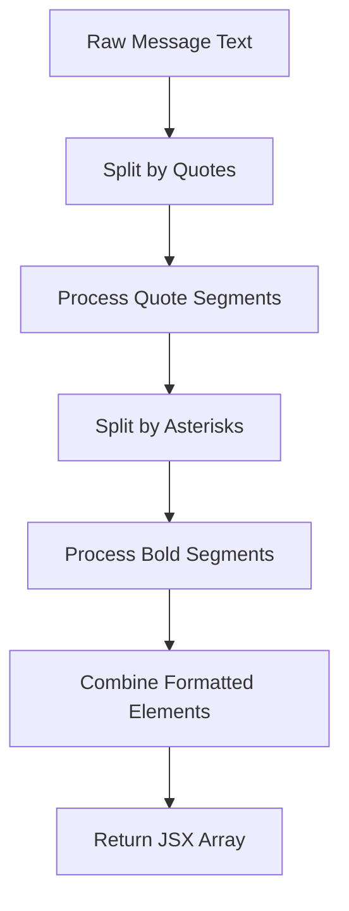
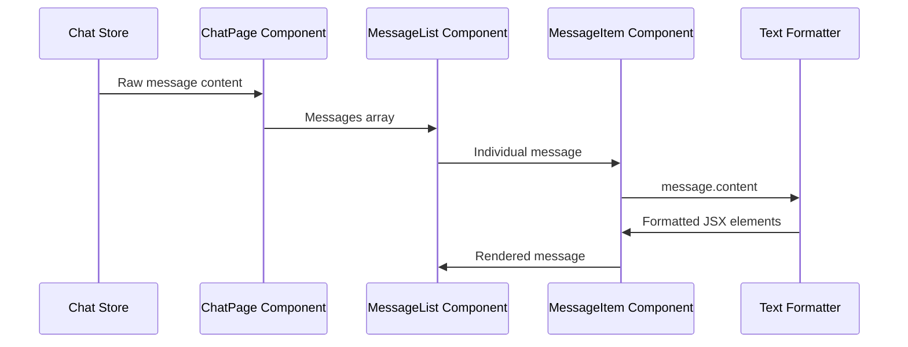

# Chat Style Updates - Text Formatting Enhancement

## Overview

This design document outlines the implementation of enhanced text formatting features in the chat interface. The enhancement will apply special styling to text wrapped in specific delimiters:
- **Bold text** (wrapped in asterisks) will display with 60% opacity
- "Quoted text" (wrapped in double quotes) will display in the primary green color

## Technology Stack & Dependencies

- **Framework**: Next.js 15.5.2 with React 19.1.0
- **Styling**: Tailwind CSS 4
- **State Management**: Zustand
- **Components**: Custom React components (MessageItem.jsx)

## Component Architecture

### Target Components

#### MessageItem Component
The primary component requiring modification to implement text formatting logic.

```
MessageItem.jsx
├── Character Messages (assistant role)
│   ├── Avatar Display
│   ├── Character Name
│   └── Message Content ← Enhancement Target
└── User Messages (user role)
    └── Message Content ← Enhancement Target
```

#### Component Hierarchy
```
ChatPage
└── MessageList
    └── MessageItem ← Primary modification target
```

### Text Processing Architecture

#### Text Parser Function
A utility function to process message content and apply formatting transformations.

**Input**: Raw message content string
**Output**: JSX elements with applied styling

**Parsing Logic Flow**:


#### Text Segment Types
| Segment Type | Wrapper | Style Applied |
|--------------|---------|---------------|
| Normal Text | None | Default styling |
| Bold Text | `*text*` | 60% opacity |
| Quoted Text | `"text"` | Primary green color |
| Combined | `*"text"*` or `"*text*"` | Both styles applied |

## Styling Strategy

### CSS Variables Integration
The implementation will utilize existing CSS custom properties:

**Primary Color Reference**:
- `--send-button-bg: #3a9e49` (Primary green)

**New CSS Variables**:
```css
:root {
  --primary-color: #3a9e49;
  --bold-text-opacity: 0.6;
}
```

### Tailwind Classes
- **Bold Text Styling**: `opacity-60`
- **Quoted Text Styling**: `text-[var(--send-button-bg)]`

## Text Processing Implementation

### Parsing Algorithm

#### Regex Patterns
- **Bold Text Detection**: `/\*(.*?)\*/g`
- **Quoted Text Detection**: `/"(.*?)"/g`

#### Processing Steps
1. **Quote Processing**: Split text by quote pattern, apply primary color to quoted segments
2. **Bold Processing**: Within each segment, split by asterisk pattern, apply opacity to bold segments
3. **Element Generation**: Create span elements with appropriate classes
4. **Key Assignment**: Assign unique keys for React rendering

### Text Formatter Component

```jsx
function formatMessageContent(content) {
  const elements = [];
  let elementKey = 0;
  
  // Split by quotes first
  const quoteParts = content.split(/"([^"]*)"/g);
  
  quoteParts.forEach((part, quoteIndex) => {
    const isQuoted = quoteIndex % 2 === 1;
    
    if (isQuoted) {
      // Process quoted text for bold formatting
      const boldParts = part.split(/\*([^*]*)\*/g);
      
      boldParts.forEach((boldPart, boldIndex) => {
        const isBold = boldIndex % 2 === 1;
        
        if (isBold) {
          // Both quoted and bold
          elements.push(
            <span 
              key={elementKey++} 
              className="text-[var(--send-button-bg)] opacity-60"
            >
              {boldPart}
            </span>
          );
        } else if (boldPart) {
          // Only quoted
          elements.push(
            <span 
              key={elementKey++} 
              className="text-[var(--send-button-bg)]"
            >
              {boldPart}
            </span>
          );
        }
      });
    } else {
      // Process non-quoted text for bold formatting
      const boldParts = part.split(/\*([^*]*)\*/g);
      
      boldParts.forEach((boldPart, boldIndex) => {
        const isBold = boldIndex % 2 === 1;
        
        if (isBold) {
          // Only bold
          elements.push(
            <span 
              key={elementKey++} 
              className="opacity-60"
            >
              {boldPart}
            </span>
          );
        } else if (boldPart) {
          // Normal text
          elements.push(
            <span key={elementKey++}>
              {boldPart}
            </span>
          );
        }
      });
    }
  });
  
  return elements;
}
```

## MessageItem Component Modifications

### Current Structure
The MessageItem component renders message content using a simple span element with `whitespace-pre-wrap` and `break-words` classes.

### Enhanced Structure
Replace the simple span with a formatted content renderer:

**Character Messages**:
```jsx
<span className="text-[var(--character-message-color)] text-base md:text-normal font-normal leading-normal tracking-[-0.4px] whitespace-pre-wrap break-words">
  {formatMessageContent(message.content)}
</span>
```

**User Messages**:
```jsx
<p className="text-[var(--user-message-color)] text-base md:text-normal font-normal leading-normal tracking-[-0.4px] whitespace-pre-wrap break-words">
  {formatMessageContent(message.content)}
</p>
```

## Data Flow Between Layers

### Message Processing Flow


### State Management Impact
- **No store modifications required**: Text formatting is purely presentational
- **Component-level processing**: Formatting occurs at render time
- **Performance consideration**: Formatting function called on every render

## Edge Cases & Validation

### Input Validation
| Case | Input | Expected Output |
|------|-------|----------------|
| Empty asterisks | `**` | No formatting applied |
| Empty quotes | `""` | No formatting applied |
| Unmatched delimiters | `*text` or `text"` | No formatting applied |
| Nested formatting | `*"nested"*` | Both styles applied |
| Escaped characters | `\*text\*` | Literal asterisks displayed |

### Error Handling
- **Malformed patterns**: Ignore formatting, display as plain text
- **Performance safeguards**: Limit processing for extremely long messages
- **React key warnings**: Ensure unique keys for all generated elements

## Testing Strategy

### Unit Testing Requirements
1. **Text Formatter Function**
   - Test bold text detection and styling
   - Test quoted text detection and styling
   - Test combined formatting scenarios
   - Test edge cases and malformed input

2. **MessageItem Component**
   - Test rendering with formatted content
   - Test preservation of existing styling
   - Test responsive behavior

3. **Integration Testing**
   - Test complete message flow from store to display
   - Test performance with large message volumes
   - Test accessibility compliance

### Test Cases
```javascript
describe('Text Formatter', () => {
  test('formats bold text with opacity', () => {
    expect(formatMessageContent('Hello *world*')).toContainElement(
      'span.opacity-60'
    );
  });
  
  test('formats quoted text with primary color', () => {
    expect(formatMessageContent('Say "hello"')).toContainElement(
      'span.text-[var(--send-button-bg)]'
    );
  });
  
  test('handles combined formatting', () => {
    expect(formatMessageContent('*"bold quote"*')).toContainElement(
      'span.text-[var(--send-button-bg)].opacity-60'
    );
  });
});
```